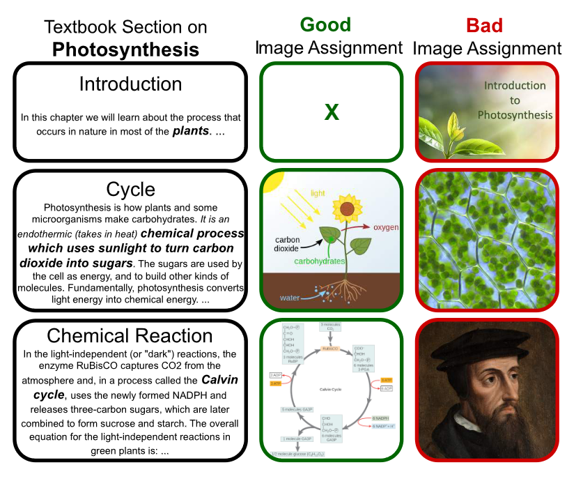
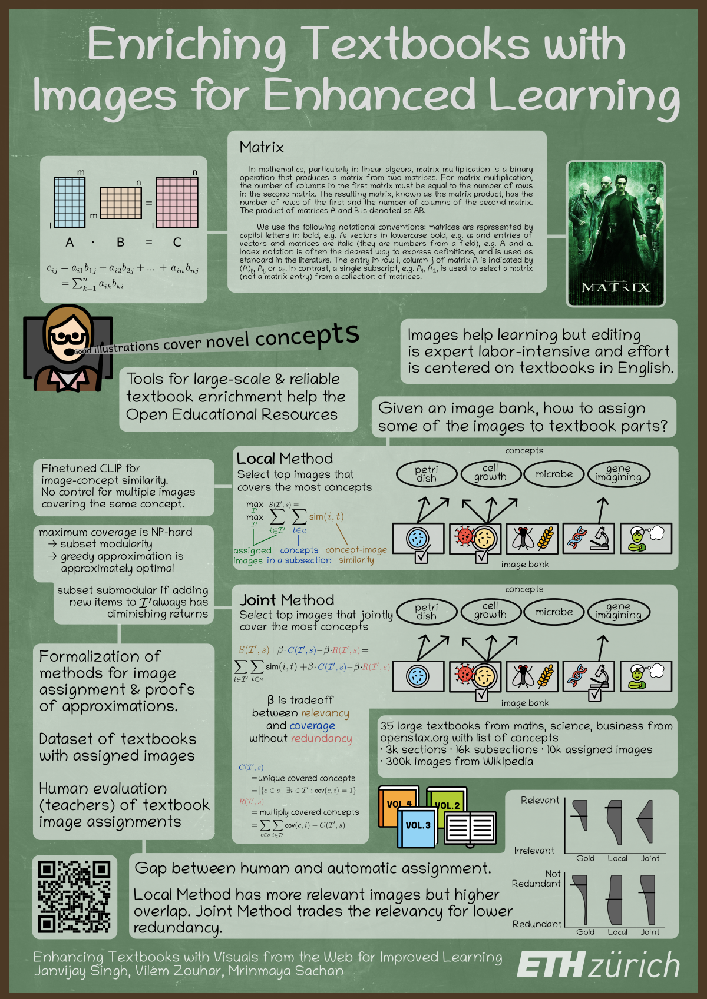

# Textbook Enrichment Dataset and Evaluation

> Textbooks are one of the main vehicles for delivering high-quality education to students.
> In particular, explanatory and illustrative visuals play a key role in the retention, comprehension and the general transfer of knowledge.
> However, many textbooks lack these interesting visuals to support student learning.
> In this paper, we investigate the effectiveness of vision-language models to automatically enhance textbooks with images from the web.
> To this end, we collect a dataset of e-textbooks from one of the largest free online publishers in the world.
> We use the  dataset analysis to motivate a text-image matching task that involves retrieving and appropriately assigning web images to textbooks, which we frame as a matching optimization problem.
> Through a crowd-sourced evaluation, we verify that (1) while the original textbook images are rated higher, automatically-assigned ones are not far behind, and (2) the precise formulation of the optimization problem matters.
> We release the dataset of textbooks with an associated image bank to spur further research in this intersectional area of NLP and computer vision for education.




## OpenStax Dataset

This dataset offers a granular representation of OpenStax books, encapsulating their content hierarchically from books to chapters, sections, and finally, subsections. It is designed to efficiently capture textual content, images, and specific terms of interest within books.

To load, run `download_dataset.sh` after cloning this repository or the one-liner:
```bash
curl -Lo- "https://raw.githubusercontent.com/eth-nlped/textbook-enrichment/main/download_dataset.sh" | bash
```
This will download first texts and then images and stores them in `data/`. You can then load it in Python:
```python
import json
data = json.load(open("data/openstax_dataset_v1.json", "r"))
```

The figures are stored in `data/figures/`

### Structure

- *Books (book_i):* Each identifier, `book_i`, denotes a separate book in the dataset.
- *Chapters (chapter_id_j):* Nested within a book, each `chapter_id_j` signifies a distinct chapter.
- *Sections (section_id_k):* Found within chapters, sections hold detailed information about specific portions of a chapter.
- *Subsections (subsection_id_l):* Optional divisions within sections for more granular content representation.
- Fields or Sections:
    - `book_name`: The title of the book.
    - `section_name`: Title of the section.
    - `subject`: Main theme or subject of the section.
    - `learning_objectives`: Goals or objectives of the section (might be absent).
    - `content`: Array of textual content snippets.
    - `summary`: Brief overview of the section (might be absent).
    - `sub_headings_indices`: Pointers to sub-headings within the content.
    - `bold_terms`: Dictionary capturing terms in bold and their positions in the content.
    - `key_terms`: Important terms featured within the section.
    - `index_terms`: Potential glossary or index terms (may or may not be present in the section).
- Fields for Subsections:
    - `text`: Extracted content specific to the subsection.
    - `text_indices`: Reference points in the main section content.
    - `images`: Details of images within the subsection, including their position, web URL, and local path.
    
Sample Access Patterns:
- To retrieve the name of a book: `data['book_i']['chapter_id_j']['section_id_k']['book_name']`.
- To obtain text from a subsection: `data['book_i']['chapter_id_j']['section_id_k']['splits'][0]['subsection_id_l']['text']`.

## Misc.

The human annotation results are stored in `data_eval/`.

Read [the EMNLP 2023 paper](https://aclanthology.org/2023.emnlp-main.731/) and cite as:
```
@inproceedings{singh-etal-2023-enhancing,
    title = "Enhancing Textbooks with Visuals from the Web for Improved Learning",
    author = "Singh, Janvijay  and
      Zouhar, Vil{\'e}m  and
      Sachan, Mrinmaya",
    booktitle = "Proceedings of the 2023 Conference on Empirical Methods in Natural Language Processing",
    month = dec,
    year = "2023",
    address = "Singapore",
    publisher = "Association for Computational Linguistics",
    url = "https://aclanthology.org/2023.emnlp-main.731",
    doi = "10.18653/v1/2023.emnlp-main.731",
    pages = "11931--11944"
}
```

## YouTube Presentation & Poster

[](https://www.youtube.com/watch?v=zjKayShiBxc)


